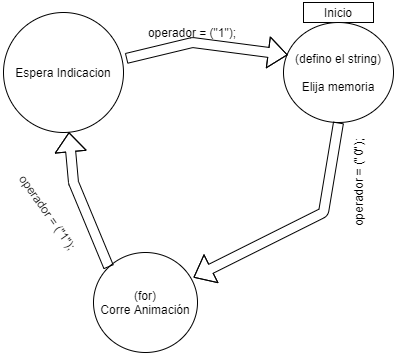

 # Memoria Descriptiva Trabajo Practico de Informatica II para Daniel Corbalan y Gustavo Viard
*Este programa es una representacion en software de un diseno con luces LED que corren en un microcomputador*<br>
- La parte analogica *luces LED y la logica de la maquina de estados* se simula como impresiones de pantalla.
- Utilizo el comando system("cls") para generar una demostracion de la animacion a ritmo de fotograma por fotograma.
- Por razones de enfocarme en desarrollar el motor y estructura de la maquina de estado me enfocare en una sola animacion, luego si alcanzo o si es obligatorio pienso generar un archivo externo de animaciones personalizadas.
- El LED prendido es un 1 y el LED apagado es un 0.

<br>
<br>
<br>
<br>
<br>


# Codigo en construccion
&#x1F53A Este código es puramente exploratorio y se convertira en maquina de estados formalmente dicho en los siguientes días. &#x1F53A



## Archivo main.c
```c
#include <stdio.h>
#include <stdlib.h>
#include <string.h>
//archivo de prototipos
#include "proto.h"
//archivo de funciones
#include "func.h"
// Pablo Javier Lopez Andura - 109947 DNI 38-456-394 UTN AVELLANEDA - INFORMATICA II - DAMIAN CORBALAN Y GUSTAVO VIARD


//macro setbit
#define setBit(reg,bit) reg|(1<<bit)
#define tamanoPalabra 4

int i=0;
int operador=1;


int main(int argc, char const *argv[]){

//inicializo las strings

    dat_t p;

    p.aniNro=0;
    char auxiliar[1]="\0";
    
    /*
    while(1)
    {
        if(operador==1){
            // archivo de memorias de animacion personalizadas
        }
    }
    */
    
    strcpy(p.palabra1,"0001");
    strcpy(p.palabra2,"0010");
    strcpy(p.palabra3,"0100");
    strcpy(p.palabra4,"1000");

    //comienzo de maquina de estados


        ascendente(p);

        printf("Operador( 0 sale ): \n");
        scanf("%d", &operador);

    p.aniNro=0;
    return 0;
}

```

## Archivo proto.h
```c
// define del tamano de una palabra LED horizontal
#define tamanoPalabra 4


//defino estructura de dat_tos de las funciones de animacion
typedef struct datos
    {
    int aniNro;
    char palabra1[10]; //hace un vector de palabras de led
    char palabra2[10];
    char palabra3[10];
    char palabra4[10];
    }dat_t;


// funciones de programa
int abrir(struct datos *);//recibe un puntero a la estructura y retorna un entero el cual indica la dimension del vector
struct datos ascendente(struct datos);

```
## Archivo func.h
```c
// archivo de funciones locales al software

//animacion de desplazamiento de palabras de LED en una direccion
struct datos ascendente(struct datos p){
    int operador=1;
    int i=0;
    for(i=0;i<4;i++){
    char auxiliar[10]="\0";
        printf("%s\n",p.palabra1);
        printf("%s\n",p.palabra2);
        printf("%s\n",p.palabra3);
        printf("%s\n",p.palabra4);
    //pasamos al primer fotograma
        system("pause");
        system("cls");

    //inicio funcion de animacion
        strcpy(auxiliar,p.palabra1);
        strcpy(p.palabra1,p.palabra2);
        strcpy(p.palabra2,p.palabra3);
        strcpy(p.palabra3,p.palabra4);
        strcpy(p.palabra4,auxiliar);
        p.aniNro++;
        }
return p;
}

int abrir(struct datos *V)//abre el archivo y vuelca los datos en un vector
{
    FILE *fp;
    struct datos aux;
    char direccion[100];
    int i=0;

    printf("\nIngrese la ubicacion del archivo: ");
    fflush(stdin);
    gets(direccion);

    while(!(fp=fopen(direccion, "rb")))//El bucle se repite mientras el archivo no se pueda abrir
        {
        printf("No se pudo abrir el archivo en la ubicacion %s....\n",direccion);
        printf("\nRevise la ubicacion y vuelva a intentarlo...");

        printf("\nIngrese la ubicacion del archivo: ");
        fflush(stdin);
        gets(direccion);
        }
    system("CLS");

    fread(&aux,sizeof(aux), 1, fp);
    while(!feof(fp)) //Paso los datos del archivo al programa
    {
        V[i]=aux;
        i++;//Lo uso como contador para luego leer e imprimir el vector
        fread(&aux,sizeof(aux), 1, fp);
    }
    fclose(fp);//cierro el archivo
    return i;
}


```
