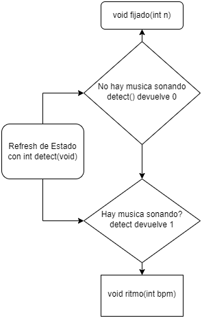

 # Memoria Descriptiva Trabajo Practico de Informatica II para Daniel Corbalan y Gustavo Viard
 </br>
- El programa constantemente verifica si se esta reproduciendo música. El prototipo puede contar con una entrada de audio (micrófono/cable 1/4 pulgada TRS) y un convertidor de analógico a digital. Una vez la señal es digital, se puede devolver un valor entero a nuestro programa con la cantidad de pulsos por minuto (beats per minute en inglés). 

</br>
</br>
</br>
</br>
</br>




## Archivo main.c
```c
/**
- El programa constantemente verifica si se esta reproduciendo música. El prototipo puede contar con una entrada de audio (micrófono/cable 1/4 pulgada TRS) y un convertidor de analógico a digital. Una vez la señal es digital, se puede devolver un valor entero a nuestro programa con la cantidad de pulsos por minuto (beats per minute en inglés).-
*/
char * getKey(char *);
//luces por fila, nuestro cuadrado de luces
#define LED 8
//librerias estandar
#include <stdio.h>
#include <stdlib.h>
//incluimos string.h para manipular archivo de configuracion
#include <string.h>
//incluimos la libreria de POSIX para las funciones sleep() y usleep()
#include <unistd.h>
//incluir tipo de datos byte para control de Led
#include "tipos.h"
//libreria funciones
#include "funciones.h"
// Esta macro es de C de bajo nivel. Nos permite encender bits directamente.
#define regBit(reg,bit) ((volatile bit_t *)&reg)->B##bit
//macros de manejo a nivel bit
        //prende bit seleccionado
#define setBit(reg,bit) reg|(1<<bit)
        //apaga bit seleccionado
#define clearBit(reg,bit) reg&~(1<<bit)
        //prende o apaga dependiendo de estado actual.
#define toogleBit(reg,bit) reg^(1<<bit)

//prototipos
int ritmo(float , display_t *, long * );
int fijado(float , display_t *, long * );
int detectar(void);

int setConfiguracion(int*,float*,long*);

//declaro puntero a funciones para los dos estados
int (*p[])(float, display_t *, long c)={ritmo,fijado};


int main(int comandoInt, char **comandoVect)
{

    int e; // declaro variable de estado, y array de leds
    float bpm; // declaro la variable de pulsos por minuto
    long c; // declaro el contador global
    display_t leds; // declaro un array bidimensional que en el primer
    int SET; //bandera de configuracion exitorsa
    SET = setConfiguracion(&e,&bpm,&c);
    //pregunta de estado
    while(SET)
    {
        e=p[e](bpm,&leds,&c);
        c++;
    }
    return 0;
}
```

## Archivo funciones.h
```c
int ritmo(float bpm, display_t *leds, long * c)
{
    /**
    ritmo recibe un float que le indica cuantas
    veces de prenden y apagan las luces en un minuto
    */

    printf("Ritmo\n");
    printf("*** Demonstracion *** \n\n");

    //impresion
        if(*c%2) // si es par o !=0 entra
        {
            // apagamos todas
            leds->fila1=0;
            leds->fila2=0;
            leds->fila3=0;
            leds->fila4=0;
            leds->fila5=0;
            leds->fila6=0;
            leds->fila7=0;
            leds->fila8=0;

        }
        else
        {
            // prendemos todas
            leds->fila1=255;
            leds->fila2=255;
            leds->fila3=255;
            leds->fila4=255;
            leds->fila5=255;
            leds->fila6=255;
            leds->fila7=255;
            leds->fila8=255;
        }
    // imprimimos en pantalla la
        printf("\nEl valor de la 1ra fila es: %d",leds->fila1);
        printf("\nEl valor de la 2nd fila es: %d",leds->fila2);
        printf("\nEl valor de la 3ra fila es: %d",leds->fila3);
        printf("\nEl valor de la 4ta fila es: %d",leds->fila4);
        printf("\nEl valor de la 5ta fila es: %d",leds->fila5);
        printf("\nEl valor de la 6ta fila es: %d",leds->fila6);
        printf("\nEl valor de la 7ma fila es: %d",leds->fila7);
        printf("\nEl valor de la 8va fila es: %d",leds->fila8);

    /* Seccion de sincronizacion de prendido y apagado
                Ya que el bpm es la cantidad de pulso por segundo
                la operacion matematica para llevar a microsegundos es la siguiente.

                ( bpm x 1/60 )^(-1) = 1 ciclo de prendido y apagado

                para llevarlo a microsegundos, lo multiplico por 1.000.000

                Utilizo microsegundos porque me permite tener mas definicion.
    */
    usleep((useconds_t)((pow(bpm/60.0,-1)*1000000)));
    system("cls");
    return detectar();
}

int fijado(float n,display_t *leds, long * c)
{
     /**
    fijado recibe un float que le indica cuantas
    veces de prenden y apagan las luces en un segundo

    */
    printf("Fijado\n");
        // inicializamos las variables
    printf("*** Demonstracion *** \n\n");

    //impresion
        if(*c%2) // si es par o !=0 entra
        {
            // apagamos todas
            leds->fila1=0;
            leds->fila2=0;
            leds->fila3=0;
            leds->fila4=0;
            leds->fila5=0;
            leds->fila6=0;
            leds->fila7=0;
            leds->fila8=0;

        }
        else
        {
            // prendemos todas
            leds->fila1=255;
            leds->fila2=255;
            leds->fila3=255;
            leds->fila4=255;
            leds->fila5=255;
            leds->fila6=255;
            leds->fila7=255;
            leds->fila8=255;
        }
    // imprimimos en pantalla la
        printf("\nEl valor de la 1ra fila es: %d",leds->fila1);
        printf("\nEl valor de la 2nd fila es: %d",leds->fila2);
        printf("\nEl valor de la 3ra fila es: %d",leds->fila3);
        printf("\nEl valor de la 4ta fila es: %d",leds->fila4);
        printf("\nEl valor de la 5ta fila es: %d",leds->fila5);
        printf("\nEl valor de la 6ta fila es: %d",leds->fila6);
        printf("\nEl valor de la 7ma fila es: %d",leds->fila7);
        printf("\nEl valor de la 8va fila es: %d",leds->fila8);

    /* Seccion de prendido y apagado en intervalos fijos

                para llevarlo a microsegundos, lo multiplico por 10.000 ya que n es un numero relativo
                desde el punto de vista practico

                Utilizo microsegundos porque me permite tener mas definicion.
    */
    usleep((useconds_t)(n*10000));
    system("cls");
    return detectar();
}

int detectar(void)
{
    int cont=0;
    printf("\nDetectando...\n");
    if(kbhit()) //simulamos deteccion de musica
        return 1;
    return 0;
}

char * getKey(char *key)
{
    char i=0;
    while(*(key+i)!=' ')
    {
        i++;
    }
    *(key+1)=0;
    return key+i+1;
}
int setConfiguracion(int *e,float *bpm,long *c)
{
    //    Codigo de lectura de archivo de configuracion.
    FILE *conf;
    char variables[3][20]={"e","c","bpm"},i; // declaro e inicializo una matriz para guardar los datos de configuracion
    char cadena[40], *key, *val; // declaro la cadena auxiliar, los punteros a valores key y val, y la variable que guardara el nombre de las configuraciones
    if((conf = fopen("config.conf","rb"))==NULL){
        printf("\n ERROR: No se encontro el archivo de configuracion.\n");
        return 0;
    }
    fgets(cadena,40,conf);
    do
    {
        key = cadena;
        if((*key)!= '#' && strlen(key) >= 0) //ignoramos comentario
        {
            val = getKey(key); // modifica a key para que solo contenga la clave y devuelve
            // printf("%s: %s\n",key, val); // Imprime resultado
            for(i=0;i<3;i++)
            {
                if(!strcmp(key,variables[i]))
                {
                    switch(i)
                    {
                        case 0: *e=atoi(val); // usamos funcion atoi
                            break;
                        case 1: *c=(long)atoi(val);
                            break;
                        case 2: *bpm=(float)atoi(val);
                            break;

                    }
                }
            }
        }
        fgets(cadena,40,conf);
    }while(!feof(conf));
    // FIN DE ARCHIVO DE CONFIGURACION
return 1;
}

```
## Archivo tipos.h
```c
typedef struct
{
    unsigned char fila1;
    unsigned char fila2;
    unsigned char fila3;
    unsigned char fila4;
    unsigned char fila5;
    unsigned char fila6;
    unsigned char fila7;
    unsigned char fila8;

}display_t;


```
