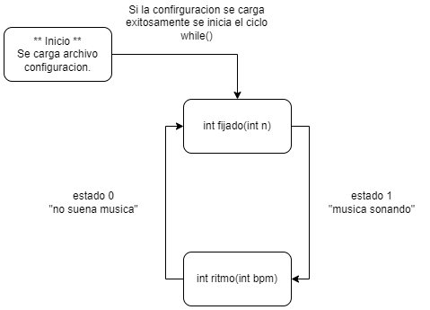

 # Memoria Descriptiva Trabajo Practico de Informatica II para Daniel Corbalan y Gustavo Viard
 <br>
 - La parte analogica *luces LED y la logica de la maquina de estados* se simula como impresiones de pantalla. <br>
 - Utilizo el comando system("cls") para generar una demostracion de la animacion a ritmo de fotograma por fotograma. <br>
 - Por razones de enfocarme en desarrollar el motor y estructura de la maquina de estado me enfocare en una sola animacion, luego si alcanzo o si es obligatorio pienso generar un archivo externo de animaciones personalizadas.<br>
 - El LED prendido es un 1 y el LED apagado es un 0.

<br>
<br>
<br>
<br>
<br>




## Archivo main.c
```c
//lado de cuadrado bidimensional
#define LED 8

#include <stdio.h>
#include <stdlib.h>
//incluimos la libreria de tiempos time.h
#include <time.h>
//libreria de typedef definidos por autor
#include "tipos.h"
//libreria funciones
#include "funciones.h"


//prototipos
void ritmo(int *bpm);
void fijado(int *n);
void prender(int, struct memoria *mem);

int main(int comandoInt, char *comandoVect)
{
    /**
    "b_bpm" es la funcion local al main que
    almacena en dinamica el valor de bpm
    para la funcion ritmo

    "e" es la variable para cambio de estado.

    "op" dicta el fin del programa
    */

    int e=0,b_bpm=120,op=0,n=100;
    //pregunta de estado
    do{
        if(e)
            ritmo(b_bpm);
        else
            fijado(n);
        // se escucha musica?
        e=detectar();
       }while(op);
//    printf("Bienvenid@\n");
    return 0;
}

```

## Archivo proto.h
```c
typedef struct memoria
{
    int leds[LED][LED];
    char n_programa[15];
}mem_t;
mem_t cL;


```
## Archivo funciones.h
```c
void ritmo(int *bpm)
{
    /**
    ritmo recibe un int que le indica cuantas
    veces de prenden y apagan las luces en un minuto

    INCOMPLETO: NECESITAMOS CONTROL DE TIEMPOS

    */
    printf("Ritmo");

}

void fijado(int *n)
{
     /**
    fijado recibe un int que le indica cuantas
    veces de prenden y apagan las luces en un segundo

    INCOMPLETO: NECESITAMOS CONTROL DE TIEMPOS

    */
    printf("Fijado\n");
}

void prender(int n, struct memoria *mem)
{
    /**
    prender cambia el estado de cada LED
    */
    // inicializamos las variables
    int i,j;
    mem_t *pm;
    pm=&mem;
    // preendemos todas
    for(i=0;i<LED;i++)
        for(j=0;j<LED;j++)
            pm->leds[i][j]=1;

    // apagamos todas
    for(i=0;i<LED;i++)
        for(j=0;j<LED;j++)
            pm->leds[i][j]-=1;
}

int tiempo(struct time_t *t)
{
    /**

    */
    time_t epoch = 0;
    printf("%s", asctime(gmtime(&epoch)));
}

int detectar(void)
{
    printf("\nDetectando\n");
    return 1;
}


```
